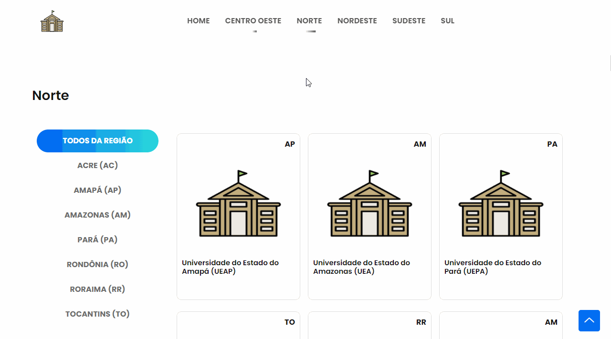

  

  
  <h3 align="center">Nossas Universidades</h3>
  

    Nossas Universidades é um projeto <b>Open Source</b> que visa listar <b>todas as nossas universidades públicas no Brasil</b> em uma página.
     
    <a href="https://reponame/issues/new?template=bug.md">Algum Problema?</a>
    ·
    <a href="https://reponame/issues/new?template=feature.md&labels=feature">Alguma Sugestão?</a>
  

---

 
  
 <strong>Universidades públicas são nossas universidades</strong>

  
**Link para acesso**: https://nossas-universidades.herokuapp.com/

### Sobre Nossas Universidades:

No brasil existe mais de <b>100 universidades públicas</b> espalhadas por todo território; fazer com que as pessoas saibam sobre essas universidades é o primeiro passo para começar a trabalhar em um país que educação é comum e não exceção.<b>Nossas Universidades é uma tentativa disso</b>.

### Objetivos:

A ideia inicialmente era listar todas as universidades públicas separada por região e estado. Hoje esses itens já estão prontos. 

Os próximos passos é informar sobre cursos, **modo de ingresso**, **nota de corte no sisu**; para facilitar para o vestibulando a sua escolha de universidade e curso.

 

 
  
  Funcionamento da pagina.

### Agradecimentos:

Um agradecimento especial a todos os colaboradores que batalharam para inserir as universidades no banco de dados.

<table style="width:100%">
  <tr align=center>
    <td>
      
    </td>
    <td>
      
    </td>
  </tr>
  <tr align=center>
    <td>
      <a href="https://github.com/dastar2">@dastar2</a>
    </td>
    <td>
      <a href="https://github.com/Nogueirinha">@Nogueirinha</a>
    </td>
    
  </tr>
</table>

---

## Copyright and license

[MIT License].

 
  feito com :hearts: para os vestibulando.

